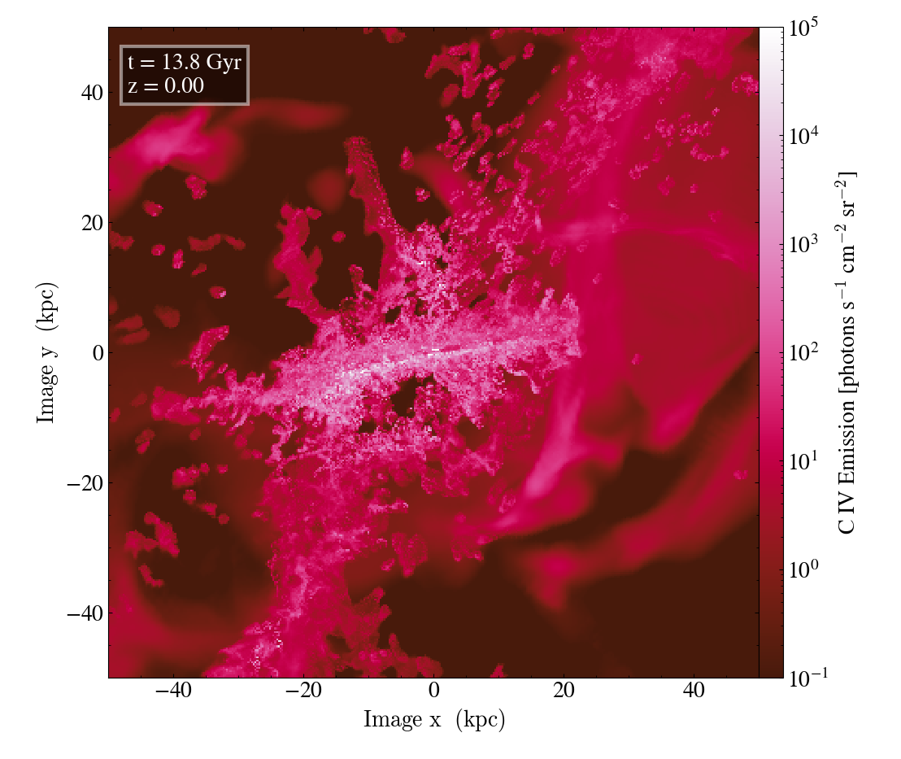
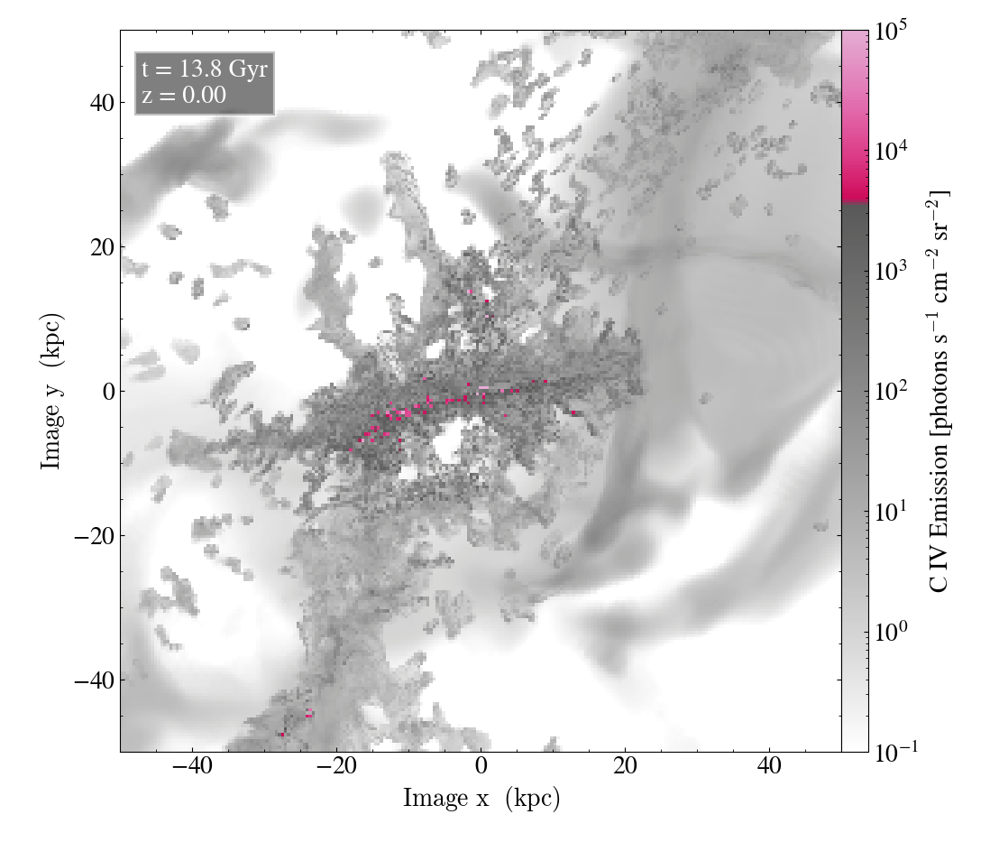

Emission maps
===============

This document describes the emission maps pipeline located in the ``foggie/cgm_emission/`` directory. 
It also provides instructions on how to run the emission maps pipeline from the command line.

Emission maps Algorithm
-----------------------

**Description:**

The algorithm generates emission maps and Fixed Resolution Buffers (FRBs) from CLOUDY tables for a specific halo and snapshot. It gets all CLOUDY files stored 
in ``foggie/cgm_emission/cloudy_extended_z0_selfshield`` and compiles them into a single table. The CLOUDY tables contain emissivity values for each ion across 
a range of temperatures and hydrogen number densities.

For each ion, the algorithm extracts the hydrogen number density and temperature from the dataset and uses these values to determine the corresponding emissivity
from the relevant CLOUDY table column. The emissivity values in the CLOUDY tables are saved as log10 Emissivities / n_H^2  in units of [erg s^-1 cm^3]. The function
``Emission_{ion_name}`` calculates the emissivity and saves it as a yt field in the dataset using one of the following units: ``photons/cm^3/s/sr`` or ``erg/cm^3/s/arcsec^2``.
The unit system can be specified using the ``--unit_system`` argument.

The algorithm also scales the emissivity by the gas metallicity since the CLOUDY calculations assume a fixed metallicity (typically solar). The final emissivity is 
then saved as a new yt field with the name ``('gas', 'Emission_' + {ion_name})``.

Depending on the ``--plot argument``, the pipeline can generate projection plots for edge-on and face-on views of surface density, convert them to FRBs, and save them
in an HDF5 file along with PNG images. Alternatively, it can save only the emission maps as PNG images.

The pipeline can be run for a specific instrument by using the ``--instrument argument``, which adjusts the emission maps according to the instrument’s specific properties,
including spatial resolution and detection limits. If you use the ``--instrument argument``, ensure that you also specify the appropriate ions detectable by that instrument. 
For example, when using ``--instrument ASPERA``, the ion should be specified as ``--ions OVI`` because Aspera only detects OVI.

The pipeline can generate full emission maps that include all gas within the field of view. Alternatively, it can create emission maps for a specific yt cut region using the
``--filter_type`` argument. This allows users to isolate particular gas components, such as inflows, outflows, or only the CGM.

**List of files:**

| Folder/Module        | Description |
* ``emission_maps_dynamic.py``: The main code to make emission maps and FRBs from CLOUDY tables for a specific halo and snapshot.

**Author:**

Vida Saeedzadeh

Running the emission maps pipeline
------------------------
**Running from command line:**

To run the emission maps pipeline directly from command line, run ``emission_maps_dynamic.py`` with by your needed arguments. For example the below command
will run the code for halo 4123 and make emission maps for CIV and OVI ions on vida_local system.
::

    python emission_maps_dynamic.py --halo 4123 --system vida_local --plot emission_map 
    --ions 'CIV,OVI'

For a full list of arguments, see below.

**Full List of Arguments:**

* ``--halo``: Which halo the emission maps should be made for? Default is 8508 (Tempest).
* ``--run``: Which run the emission maps should be made for? Default is nref11c_nref9f.
* ``--output``: Which output(s) the emission maps should be made for? Options: Specify a single output (default: RD0042) or a range of outputs (e.g., "RD0020,RD0025" or "DD1340-DD2029").
* ``--output_step``: If you want to do every Nth output, this specifies N. Default: 1 (every output in the specified range).
* ``--system``: Which system the code should be run on? .
* ``--pwd``: Just use the working directory? Default: no.
* ``--nproc``: How many processes do you want? Default is 1 (no parallelization). If multiple outputs and processors are specified, the code will run one output per processor.
* ``--save_suffix``: Do you want to append a string to saved filenames? Default: no.
* ``--file_suffix``: If plotting from saved surface brightness files, specify the file name suffix. Default: "".

Emission maps setting arguments:

* ``--plot``: What do you want to plot? Options are:
              emission_map: Plots an image of projected emission lines (edge-on and face-on).
              emission_map_vbins: Plots multiple images of projected emission lines in line-of-sight velocity bins.
              emission_FRB: Makes FRBs of projected emission lines (edge-on and face-on). Default is emission_FRB.
* ``--unit_system``: What unit system to use? Default: photons. Options:
                     default: photons (photons * s**-1 * cm**-3 * sr**-1).
                     erg: ergs (ergs * s**-1 * cm**-3 * arcsec**-2).
* ``--ions``: What ions do you want emission maps or FRBs for? Options: Lyalpha, Halpha, CII, CIII, CIV, MgII, OVI, SiII, SiIII, SiIV.
              To specify multiple ions, use a comma-separated list without spaces (e.g., "CIII,OVI,SiIII").
* ``--fov_kpc``: What is the field of view width in kpc (e.g., 100)? Default: None (uses the refine box width if None).
* ``--fov_arcmin``: What is the field of view width in arcmin (e.g., 4)? Default: None (uses the refine box width if None).
* ``--scale_factor``: Do you want to scale the emissivity to observation? How much? Default: 1 (no scaling).

Cut regions arguments:

* ``--filter_type``: What yt cut region you want the emission maps to be made for? Default: None. Options: inflow_outflow, disk_cgm.
* ``--shell_count``: If you are using ``--filter_type disk_cgm`` then you can choose if you want shells around the disk to be removed 
                     as part of the disk removel and getting CGM.How many shells around the disk when using the disk_cgm filter? Default: 0.

Instrument Specific arguments:

* ``--instrument``: Which instrument criteria do you want to use?use all caps for name of instruments. Default: None. Options: DRAGONFLY, ASPERA, JUNIPER, MAGPIE, HWO, MUSE.
* ``--res_arcsec``: What is the instrument spatial resolution in arcseconds? Default: None.
* ``--target_z``: What is the target redshift for your instrument? Default: None.

**Author:**

Vida Saeedzadeh

**Examples**

An example for running the emission maps pipeline for halo 8508, output RD0042, and make emission maps for CIV ion on vida_local system.
::

    python emission_maps_dynamic.py --halo 5036 --output RD0042 --system vida_local 
    --plot emission_map --ions 'CIV' --fov_kpc 100 

Here how the edge on map looks like:

An example for running the emission maps pipeline for halo 8508, output RD0042, and make emission maps for CIV ions on vida_local system and 
instrument JUNIPER.
::

    python emission_maps_dynamic.py --halo 5036  --output RD0042 --system vida_local
    --plot emission_map --ions 'CIV,OVI' --instrument JUNIPER --target_z 0.001 --res_arcsec 20 
    --fov_kpc 100 

